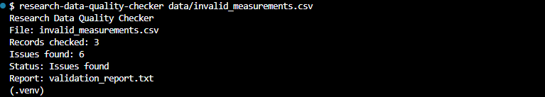
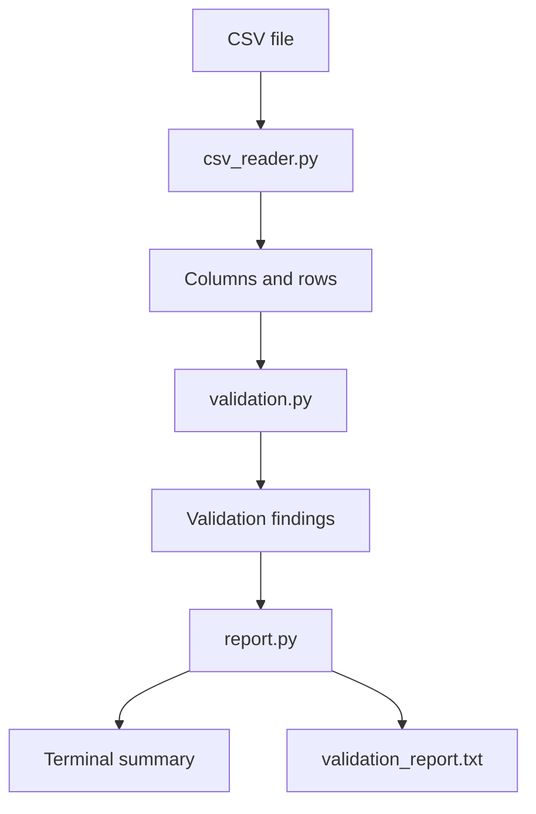

# Research Data Quality Checker

A Python command-line tool for validating structured meteorological research data stored in CSV files.

The project checks a predefined CSV schema for missing values, invalid numbers and dates, duplicate measurement IDs, and implausible measurement values. It produces a compact terminal summary and a detailed text report without modifying the original input file.

## Project Status

**Feature complete for the defined project scope**

The core application is implemented and can be installed and executed as a command-line tool. Automated tests and static code checks are used to verify the defined project requirements.

## Features

- Reads one local UTF-8 encoded CSV file per run
- Validates required CSV columns
- Detects missing or whitespace-only required values
- Validates positive integer measurement IDs
- Validates decimal measurement values
- Validates calendar dates in `YYYY-MM-DD` format
- Detects duplicate `measurement_id` values
- Checks meteorological values against predefined plausibility ranges
- Collects multiple findings during a single validation run
- Creates a detailed text report
- Shows a compact validation summary in the terminal
- Handles missing or unreadable input files with controlled error messages
- Leaves the original CSV file unchanged

## Expected CSV Format

The application expects a comma-separated CSV file with a header row and the following required columns:

| Column | Expected value | Validation |
|---|---|---|
| `measurement_id` | Positive integer | Required and unique |
| `station_id` | Text | Required |
| `measurement_date` | Date | Valid calendar date in `YYYY-MM-DD` format |
| `temperature_c` | Decimal number | `-50.0` to `60.0` °C |
| `humidity_percent` | Decimal number | `0.0` to `100.0` % |
| `pressure_hpa` | Decimal number | `850.0` to `1100.0` hPa |

All limits are inclusive.

Additional CSV columns are allowed and ignored by the validator.

The CSV format uses:

- UTF-8 encoding
- comma as delimiter
- dot as decimal separator
- first row as column header

### Example Input

```csv
measurement_id,station_id,measurement_date,temperature_c,humidity_percent,pressure_hpa
1001,BERLIN_01,2026-08-10,24.7,58.0,1012.4
1002,POTSDAM_01,2026-08-11,25.2,55.3,1011.6
1003,HAMBURG_01,2026-08-12,19.8,72.1,1008.9
```

## Requirements

- Python 3.14 or newer

The application itself uses only the Python standard library.

## Installation

Clone or download the repository and open a terminal in the project directory.

Create a virtual environment:

```bash
python -m venv .venv
```

Activate it in Git Bash on Windows:

```bash
source .venv/Scripts/activate
```

On Linux or macOS:

```bash
source .venv/bin/activate
```

Install the project in editable mode:

```bash
python -m pip install -e .
```

The command-line application is then available as:

```text
research-data-quality-checker
```

## Usage

Run the validator and provide the path to one CSV file:

```bash
research-data-quality-checker data/valid_measurements.csv
```

### Example: Valid Dataset

```text
Research Data Quality Checker
File: valid_measurements.csv
Records checked: 3
Issues found: 0
Status: No issues found
Report: validation_report.txt
```

### Example: Dataset with Quality Issues

```bash
research-data-quality-checker data/invalid_measurements.csv
```

Example terminal output:

```text
Research Data Quality Checker
File: invalid_measurements.csv
Records checked: 3
Issues found: 6
Status: Issues found
Report: validation_report.txt
```

The detailed findings are written to:

```text
validation_report.txt
```

Example finding:

```text
1. Type: missing_value
   Row: 3
   Measurement ID: 1002
   Column: station_id
   Value: <empty>
   Description: Required value is missing.
```

If the input file does not exist, the application terminates with a controlled error message and exit code `1`.

```text
Error: Input file not found: data/does_not_exist.csv
```

### CLI Example

The following screenshot shows the validation of the included invalid example dataset:



## Application Flow



The modules have deliberately separated responsibilities:

- `main.py` coordinates the complete application workflow and handles technical errors.
- `csv_reader.py` reads CSV files and provides their contents to the validation layer.
- `validation.py` contains the data-quality rules and creates structured findings.
- `report.py` creates the terminal summary and detailed text report.

## Project Structure

```text
research-data-quality-checker/
├── data/
│   ├── invalid_measurements.csv
│   └── valid_measurements.csv
├── docs/
│   └── images/
│       └── cli-invalid-dataset.png
├── src/
│   └── research_data_quality_checker/
│       ├── __init__.py
│       ├── csv_reader.py
│       ├── main.py
│       ├── report.py
│       └── validation.py
├── tests/
│   ├── test_csv_reader.py
│   ├── test_integration.py
│   ├── test_main.py
│   ├── test_report.py
│   └── test_validation.py
├── .gitignore
├── LICENSE
├── pyproject.toml
└── README.md
```

## Testing and Code Quality

The project uses `pytest` for automated testing and Ruff for static code checks.

Run the complete test suite:

```bash
pytest
```

Run Ruff:

```bash
ruff check src tests
```

The tests cover the defined project requirements, including:

- valid datasets
- missing required columns
- missing required values
- invalid numerical values
- invalid calendar dates
- duplicate measurement IDs
- values inside, on, and outside plausibility limits
- multiple findings in a single validation run
- CSV reading and module integration
- report generation
- missing input files
- the complete application workflow

## Test Data

The files in `data/` are small synthetic datasets created specifically for this project.

They do not represent real scientific measurements and do not originate from an external data source. Their purpose is to provide reproducible examples for testing and demonstrating the application.

## Known Limitations

This project deliberately has a limited scope.

- Only the predefined meteorological CSV schema is supported.
- Only one local CSV file can be processed per program run.
- The schema and plausibility limits are not configurable.
- Additional columns are ignored rather than validated.
- The application detects data-quality issues but does not correct them.
- Reports are written as plain text.
- A previous `validation_report.txt` may remain on disk if a later run fails before a new report is created.
- The validation rules cannot determine whether measurements are scientifically correct.
- The automated tests cover the defined project requirements, not every possible problem found in real-world research datasets.
- No graphical user interface, database, web application, external API access, or machine-learning functionality is included.

## Project Context

This project was developed as a learning and portfolio project in preparation for vocational training in application development.

Its purpose is to practise fundamental software-development skills in a research-data context, including:

- Python modules and functions
- file processing
- lists and dictionaries
- validation logic
- error handling
- automated testing
- debugging
- command-line applications
- Git and GitHub
- structured technical documentation

The project also serves as an introduction to an important principle of research software: data should be checked for structural and plausibility problems before further analysis or visualization.

## License

This project is licensed under the MIT License. See [LICENSE](LICENSE) for details.